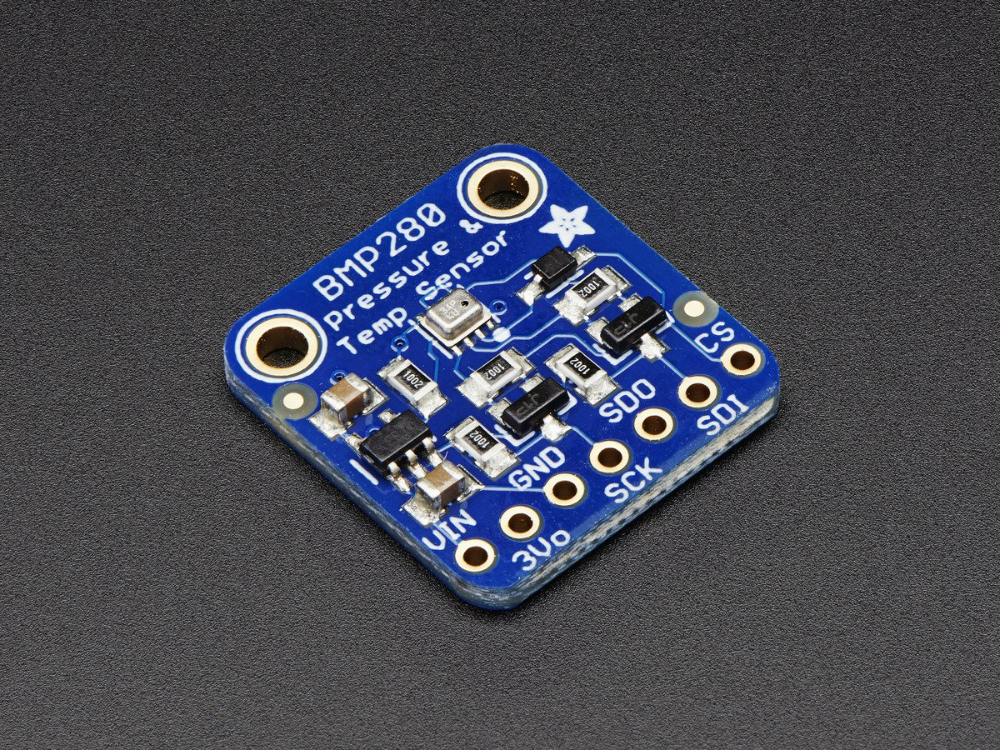

## Important, about  IC2 adress in THIS (modified) library ##
Adafruit created this library for a their own sensor, so it was necessary to make modifications for the sensor used in the IC2 address. This library is open source and credits go to Kevin (KTOWN) Townsend for Adafruit Industries. It is detailed below for which sensor the original library works and for which it is necessary to use this modified one (see images).
## Sensor for which this MODIFIED library is required ##
(If sensor looks as in picture below)

## The ORIGINAL Adafruit library works for: [Adafruit BMP280 Breakout](http://www.adafruit.com/products/2651) ##

## About this Driver ##

Adafruit invests time and resources providing this open source code.  Please support Adafruit and open-source hardware by purchasing products from Adafruit!

Written by Kevin (KTOWN) Townsend for Adafruit Industries.
