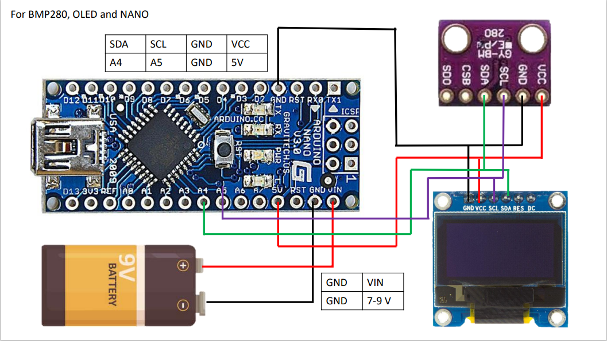

# TinyTelemetry
A very simple, arduino based telemetry system for recording the maximum historic altitude and time of flight for model rocketry and airplane models in a blackbox payload style. The upcoming of this project occurred by the need to obtain the maximum altitude and flight time for a model rocket, while keeping it as light, and small as possible. As far as i'm concerned you can shrink this further by using an even smaller board such as the Seeduino, and soldering everything as tightly as possible into a motherboard, the main trouble with weight and volume is the battery, while you can power this with 4 AAAs or a single 9V (depending which form factor suits you best) it would be ideal to have a single, tiny lithium cell, which if you have the chance to do I would encourage you to do so.

I attempted (and will continue to attempt, yet probably not upload unless this project gains some attention) to add to this system an accelerometer, the MPU6050, the reason being that the current way to count time relies only on the barometric sensor BMP2080, detecting lift-off and crashing by a change in Δaltitude readings, which fluctuates overtime with barometric pressure and needs at least a 1 meter increment to start counting (as programed in V1.8, may be fine-tuned later) and for it to land in the range of initial_altitude-1m<initial_altitude<initial_altitude+1m 
`(A-1 <= A <= A+1)`, else it will not stop counting, the accelerometer would allow for MUCH more precise time recording, even adding a extra layer of verification and redundancy to max_alt recording by using acceleration data.

## Pros & Cons of the actual version:

### Pros:
- Very easy to make for beginners.
- Commented code to make it easy to understand.
- Cheap project (under USD 15$).
- Can be used as a base for you to modify to your need.
- Complete with full instructions on how to.

### Cons:
- Lacks time precision for short flights.
- Lacks altitude precision for long flights.
- Expected to be retrived at landing (no data broadcast).

> If you make advances based on this code and achieve better results, or add helpful support for sensors (such as the accelerometer) or for tyni-er boards, please do share!

## Instructions, how to:
1. Download all files.
2. Download [ArduinoIDE](https://www.arduino.cc/en/software).
3. Extract all files somewhere.
5. [Check if you need to use the BMP280 MODIFIED library](https://github.com/fgutep/TinyTelemetry/tree/main/Modified%20libraries/Adafruit_BMP280_Library) on readme.md.
6. If you need the modified libraries then go to the extracted files > Modified Libraries > Adafruit_BMP280_Library, and COMPRESS that folder as .zip. 
7. Open Arduino IDE.
8. Go to Program > Add Libraries> Add.zip library.
9. (If on step 5 you realized you do need the modifyed library) Browse for the compressed .zip and import it.
10. Go to [Required Libraries](https://github.com/fgutep/TinyTelemetry/blob/main/RequiredLibraries), enter to each link, and download the libraries .zip's.
11. Repeat step 8 unitll imported each library.
12. FINALLY, get your hands dirty, wire all components as shown:

13. Compile the code.
14. On Arduino ID, go to Tools> Board> (Select your board).
15. If using my very same Arduino you'll need to go to tools> Processor> ATMEGA328P (Oldbootloader). If not, don't unless having issues.
16. Connect the arduino by USB to your PC, and select whatever there is on >Tools > Port > Com(#).
17. Flash the code to the arduino using the arrow logo next to the check mark (compile).
18. Done, it should work now.
19. IF YOU USED A DIFFERENT OLED, you'll need to change the pixer ratio on `#define SCREEN_WIDTH` `#define SCREEN_HEIGHT`, and on the display code, where commented as (x,y). Until it looks good.
20. Should be done, enjoy your TinyTelemetry :D.
